# SRIN Take Home Assignment

This work belongs to Rafif Taris.

## Try Out Docker

### Pull an Image from a Registry

First of all, Docker provides a service for finding and sharing plugins and images, called [Docker Hub](https://hub.docker.com/). With Docker Hub, developers can share their own images by utilizing the Docker Registry. Docker Hub also provides commonly used images, such as programming languages, SQL, etc.

On Docker CLI, use this command to pull an image from a registry.

> `docker pull [OPTIONS] NAME[:TAG|@DIGEST]`

For example, use this command pull ubuntu image that is provided by Docker.

> `docker pull ubuntu`

If the tag is not defined, it will be set as `latest` by default.

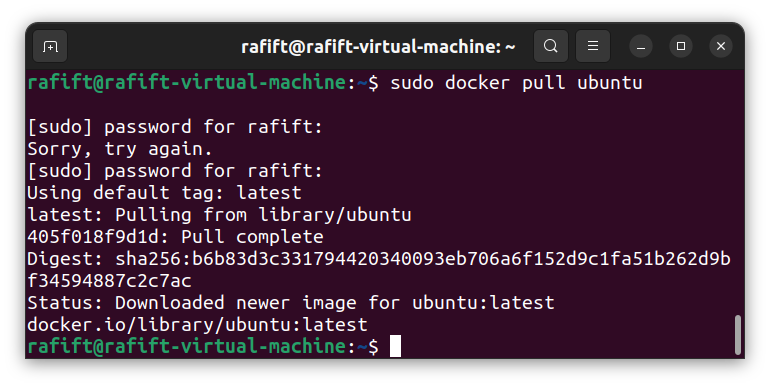

On the other hand, we can pull public images from a specific registry. For example, use this command to pull an image from *rafiftaris* registry.

> `docker pull rafiftaris/quilloc-be:latest`

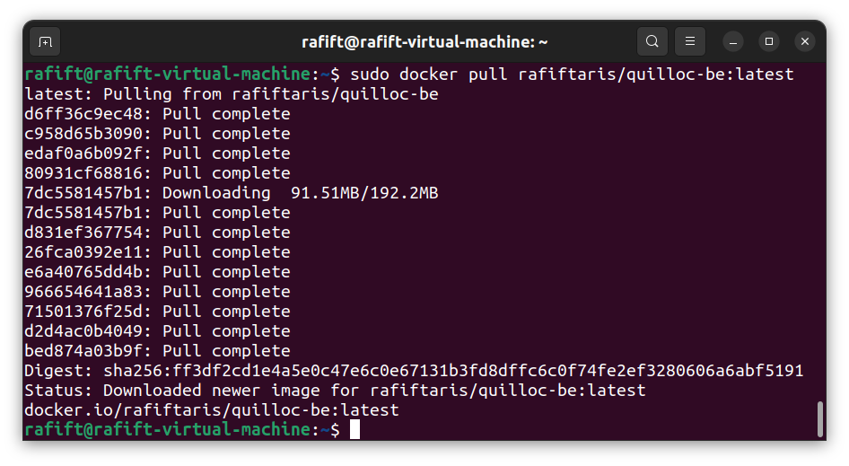

### List Images

After pulling images from a registry, we can see the list of images in the local environment. On Docker CLI, use this command to list the local images.

> `docker images` or `docker image ls`

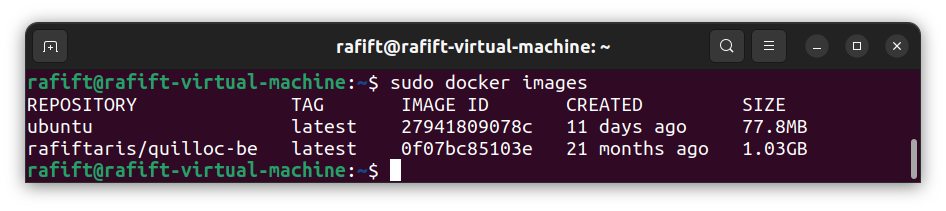

As we can see from the images above, both `ubuntu` and `rafiftaris/quilloc-be` are the images that we pulled before.

### Run a Container

Images that have been pulled from the registry can be built into a container. On Docker CLI, use this command to run a container from a specific local image.

> `docker run IMAGENAME`

For example, use this command to run the container of rafiftaris/quilloc-be image.

> `docker run rafiftaris/quilloc-be`

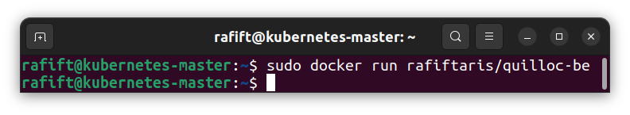

It seems that nothing happened but actually a container has been run and exited with code 0. We can see it by listing all container thoroughly.

### List containers

Containers that are currently up and running can be listed by using this command.

> `docker container ls`

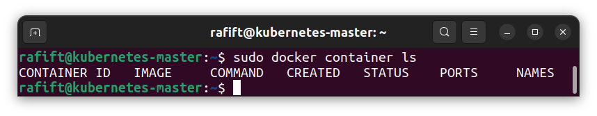

As stated before, the container list is empty. If we want to list **all** containers, including the inactive ones, use this command.

> `docker container ls -a`

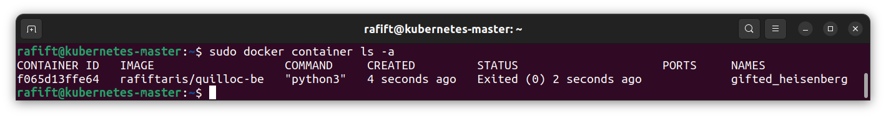

### Create and Build Simple Custom Container Using Dockerfile

Dockerfile is used to create customized image by defining steps needed. For example, create a python-based Dockerfile that will copy all of this folder's content to the image. You can check the file [here](./Docker/Dockerfile).

After creating Dockerfile, use this command to build the Dockerfile into an image.

> `docker build ./Docker`

We need to define which folder that contains the Dockerfile.

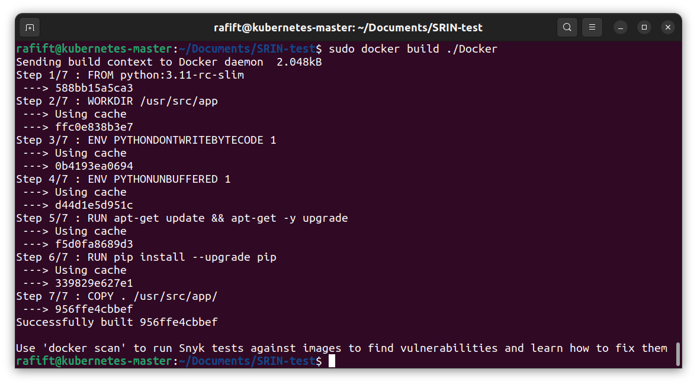

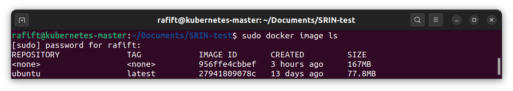

If we look at the image list, this image will have no name. Therefore, use this command instead when building an image.

> `docker build -t custom-image ./Docker`

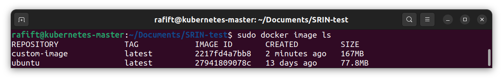

Instead of building the image manually, we can use `docker-compose.yml` file to define how to create the custom container automatically. The docker-compose file can be checked [here](./Docker/docker-compose.yml). Use this command to run the docker compose based on the docker-compose file.

> `docker-compose -f ./Docker/docker-compose.yml up`

Use the -f option to define the docker-compose.yml file location.

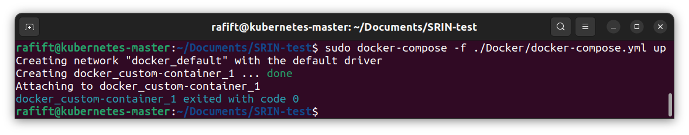

## Ansible

### Advantage & Disadvantage of Ansible for Deployment Process

There are several advantages that Ansible provides, such as:
- YAML Scripting
YAML can be easily configurable and manageable. This leads to easier infrastructure deployment.

- Various modules
Ansible has modules that can be used as an alternative to shell commands. Developers just have to provide required arguments for the modules.

On the other hand, Ansible has several disadvantages that needs to be paid attention, such as:

- Unable to handle large files
Since Ansible serializes and deserializes JSON data internally between tasks this way of processing consumes a lot of CPU if large amounts of data are present.

- Conditional and looping
It gets complicated if the playbook use loops and if-else condition. Therefore, Ansible may not be suitable for automation with complex flow.

### Ansible Playbook

The ansible playbook script can be checked [here](Ansible/playbook.yaml). Use this command to run the ansible playbook from current directory.

> `ansible-playbook ./Ansible/playbook.yaml`

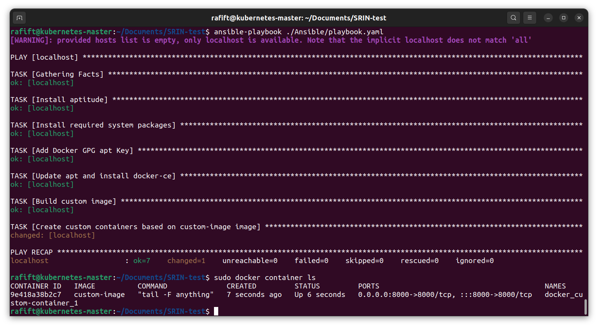

## Kubernetes

> **Problem**: Can't run kubectl commands because connection refused to `localhost:8080`. Have attempted to copy the admin.conf file to `/home/user/` directory after `kubeadm init` but the error still persists.

### Create a Deployment (Stateless Application) based on the YAML file

Lorem ipsum

### Access App/Service from Outside Kubernetes Network

Lorem ipsum

### List Pods

To list all available pods, use this command:

> `kubectl get pods -A`

### List Service

To list all services, use this command:

> `kubectl get services -A`

### Differences between Pods and Deployment

- Pods
Kubernetes pods is the smallest unit of deployment. Kubernetes pods may contain a cluster of one or more containers that share the same configurations. Containers that in the same pods can communicate and share data easily through **localhost**. Basically, a Kubernetes pod is intended to run a specific task of the application. Kubernetes pod is created by using pod template.

- Deployment
Kubernetes deployment is a tool that manages the performance and specifies the desired behavior or traits of a pod. Developers use Kubernetes Deployment to communicate what they want from an application, so Kubernetes can take steps to achieve the desired state of application.